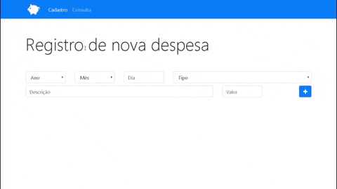
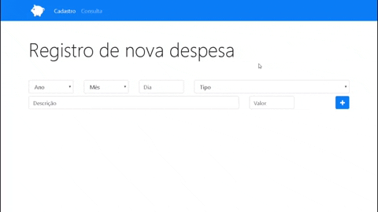

# App Orçamento Pessoal :dollar:
Essa é uma pequena aplicação web onde o usuário pode registrar suas despesas, consultá-las e excluí-las quando quiser, o que consequentemente o ajudará a organizar melhor sua vida financeira<br><br>Você pode ver o <strong>resultado final</strong> logo abaixo :arrow_heading_down:

## Tecnologias utilizadas :rocket:

- HTML5, Bootstrap 4 e Javascript puro para execução da lógica de registro, consulta e exclusão de despesas
- Nunjucks como template engine para poder reaproveitar o mesmo HTML em várias páginas
- NodeJS e Express para organizar as rotas da aplicação e enviar dados para a template engine renderizar no browser
- Recurso de Local Storage oferecido pelo Browser para armazenar os dados

<hr>

## Objetivo do projeto :dart:

Meu objetivo ao desenvolver este projeto foi principalmente praticar Javascript, e também consegui praticar bem o conceito de template engine, visto que aprendi a usar esse tipo de tecnologia recentemente.

<hr>

## Resultado final :framed_picture:

   ### Registrando despesa
   
   
   ### Consultando e excluindo despesa
   
 
<hr>

## Como executar o projeto em sua máquina :arrow_forward:

Para utilizar a aplicação, você precisará ter o [Git](https://git-scm.com) e o [Node.JS/NPM](https://nodejs.org/pt-br/) instalados em seu computador.

Após ter instalado eles, clique com o botão direito do mouse dentro de algum diretório de seu computador e escolha a opção "Git Bash Here", isso abrirá um terminal de linha de comando, agora basta seguir os seguintes passos:

### Baixando o projeto
```bash
# Clone o repositório em algum diretório de seu computador
$ git clone https://github.com/TiagoDiass/app-orcamento-pessoal.git

# Entre no repositório
$ cd app-orcamento-pessoal
```

Após ter entrado na raiz do projeto(na pasta app-orcamento-pessoal), você só precisará instalar as dependências e iniciar o projeto:

```bash

# Instale as dependências
$ npm install

# Inicie a aplicação
$ npm start
```

Após ter realizado estes passos, o projeto estará rodando na porta 5000 da sua máquina, basta entrar em seu browser e digitar "localhost:5000" na barra de endereços de seu navegador, e lá estará o projeto funcionando :D<br><br>
Para fechar a aplicação basta entrar no terminal que você deixou aberto após tê-la iniciado, e apertar CTRL+C para encerrar seu funcionamento, caso deseje iniciá-la novamente basta digitar "npm start" e ela será iniciada novamente.
